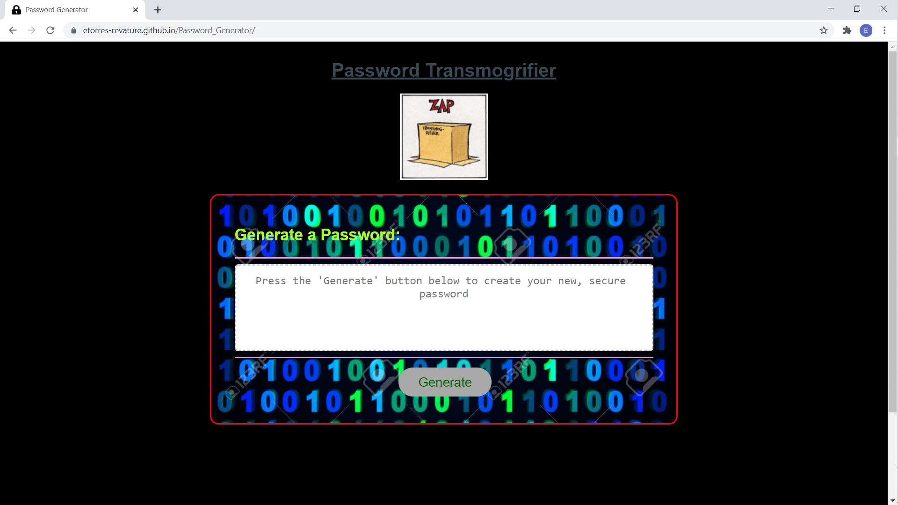

# :lock: [Password_Generator](https://etorres-revature.github.io/Password_Generator/) :key:

As technology has become more ubiquitous in our everyday lives, so to has the proliferation of cyber-crime in the form of malware, ransomware, and other large scale data breaches. 
 

This applicaiton uses HTML5, CSS, Bootstrap 4, and JavaScript to create a strong, unique password.

<a align="justify">When the "Generate" button is pushed, the program will create an array of arrays based on choices for upper case letters, lower case letters, numbers, and/or special characters.

<a align="justify">Then the password is created based on the length of the passwrod selected.</a>

<a align="justify">(All javascript alert/confirm are validated to ensure proper selection is made by the end-user.)

<a align="justify">Finally, the newly generated password is presented to the end-user through the viewport.
 

Try the [Password Generator](https://etorres-revature.github.io/Password_Generator/).

### Cyber-crime Consequences<a href="#footnote1">[1]</a>

1. :moneybag: Fnancial Costs :moneybag:
    * compensating affected customers :money_with_wings:
    * incident response to investigate breach :money_with_wings:
    * investment in new security measures :money_with_wings:
    * legal fees :money_with_wings:
    * regulatory penalties :money_with_wings:

2. :facepunch: Reputatoinal Damage :facepunch:
    * loss of customers :thumbsdown:
    * bad word of mouth :thumbsdown:
    * long-lasting  :thumbsdown:

3. :warning: Operational Downtime :warning:
    * operations disrupted :no_entry_sign:
    * contain and investigate breach :no_entry_sign:
    * may be completely shut down :no_entry_sign:

4. :cop: Legal Action :cop:
    * individuals seek legal action to claim compensation :briefcase:
    * class action lawsuits :briefcase:
    * more breaches = more litigation :briefcase:

### TIPS FOR A :muscle: PASSWORD

| Tip | Explanation<a href="#footnote2">[2]</a> |
|-----|-------------|
| LONG | the longer the better, but at least 10 characters long |
| RANDOM | if your letter combinations are not in the dictionary, they are not published |
| VARIETY | mix up special symbols and numbers with both capital and lower case letters |
| NON-OBVIOUS | not information that is easily discoverable -- date of birth, anniversary, address, high school, etc. |
| UNIQUE | use one password for each account |
| MANAGER | use a service that auto-generates and stores strong paswords on your behalf in one centralized, encrypted location that only you can access with the master password |
| PRIVATE |don't share your password with anyone else |
| ROTATE | the more sensitive information is, the more often you should change your password |

### Technologies Used

#### HTML5

HTML5 is a markup language used for structuring and presenting content on the World Wide Web.  The goals are to improve the language with support for the latest multimedia and other new features; to keep the language both easily readable by humans and consistently understood by computers and devices; and to remain backward compatible to older software.  Many new symantic features are included.

HTML5 content borrowed from <a target="_blank" rel="noopener noreferrer">[this page](https://en.wikipedia.org/wiki/HTML5).</a>

#### CSS

Cascading Style Sheets (CSS) is a stylesheet language used for describing the presentation of a document written in a markup language (such as HTML5).  CSS is designed to enable the separation of presentation and content; including layout, colors, and fonts.  This separation improves content accessibility to provide more flexibility and control in the specification of presentation characteristics, enabling multiple web pages to share formatting by specifying relevant CSS in a separate file, which reduces complexity and repetition in the structural content (HTML), as well as enabling the file to be cached to improve the page load speed between the pages that share the file and its formatting.

Separation of formating and content also makes it feasible to present the same markup page in different styles for different rendering methods, such as on-screen, in print, by voice, and on Braille-based tactile devices.  

CSS content borrowed from <a target="_blank" rel="noopener noreferrer">[this page](https://en.wikipedia.org/wiki/Cascading_Style_Sheets).</a>

#### Bootstrap 4

Bootstrtap 4 is a free and open-source CSS framework directed at responsive, mobile-first front-end web development.  It contains CSS and (optionally) JavaScript-based design templates for typography, forms, buttons, navigation, and other interface components.  

Bootstrap 4 content borrowed from <a target="_blank" rel="noopener noreferrer">[this page](https://en.wikipedia.org/wiki/Bootstrap_(front-end_framework)).</a>

#### JavaScript

JavaScript(JS) is one of the core technologies of the World Wide Web (along with HTML and CSS). It enables interactive web pages and is an essential part of web applications.  JS is a multi-faceted, scripting language that provides versatility through Application Programming Interfaces (APIs) and Document Object Model (DOM) manipulation, among others.

JavaScript content borrowed from <a target="_blank" rel="noopener noreferrer">[this page](https://en.wikipedia.org/wiki/JavaScript).</a>

## Author :sunglasses:

Content and design created by :green_heart: Eric D. Torres :green_heart:.  

The author can be reached at etorresnotary@gmail.com. 

#### License

MIT License

Copyright (c) 2020 EricDTorres

Permission is hereby granted, free of charge, to any person obtaining a copy
of this software and associated documentation files (the "Software"), to deal
in the Software without restriction, including without limitation the rights
to use, copy, modify, merge, publish, distribute, sublicense, and/or sell
copies of the Software, and to permit persons to whom the Software is
furnished to do so, subject to the following conditions:

The above copyright notice and this permission notice shall be included in all
copies or substantial portions of the Software.

THE SOFTWARE IS PROVIDED "AS IS", WITHOUT WARRANTY OF ANY KIND, EXPRESS OR
IMPLIED, INCLUDING BUT NOT LIMITED TO THE WARRANTIES OF MERCHANTABILITY,
FITNESS FOR A PARTICULAR PURPOSE AND NONINFRINGEMENT. IN NO EVENT SHALL THE
AUTHORS OR COPYRIGHT HOLDERS BE LIABLE FOR ANY CLAIM, DAMAGES OR OTHER
LIABILITY, WHETHER IN AN ACTION OF CONTRACT, TORT OR OTHERWISE, ARISING FROM,
OUT OF OR IN CONNECTION WITH THE SOFTWARE OR THE USE OR OTHER DEALINGS IN THE
SOFTWARE.

<a name="footnote1">[footnote 1](https://www.metacompliance.com/blog/5-damaging-consequences-of-a-data-breach/)</a>

<a name="footnote2">[footnote 2](https://www.mentalfloss.com/article/504786/8-tips-make-your-passwords-strong-possible)</a>

